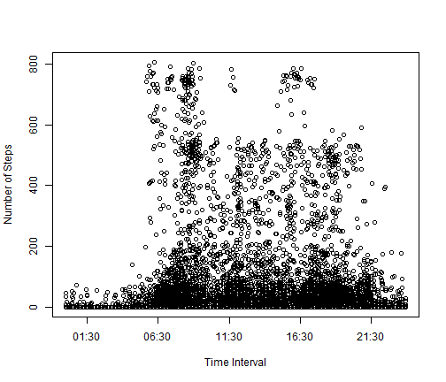
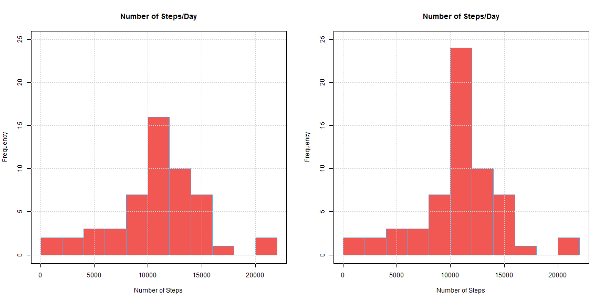
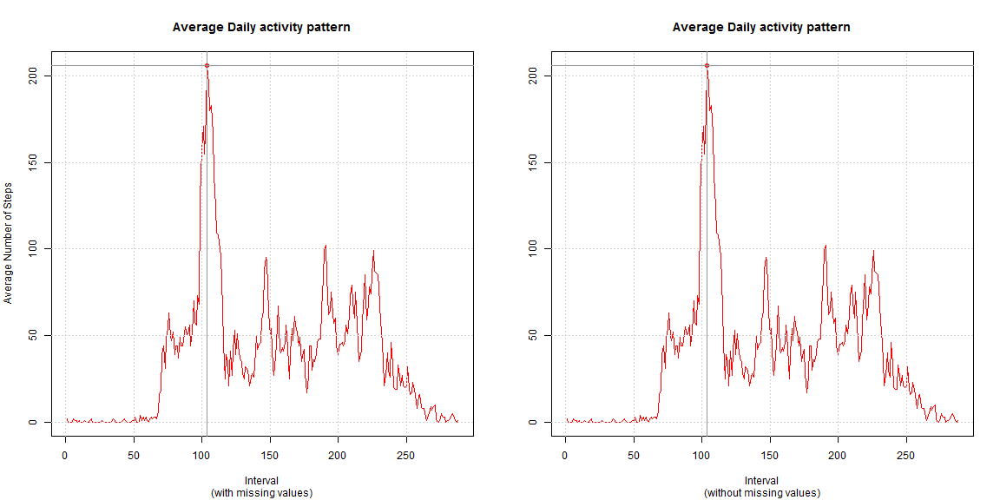
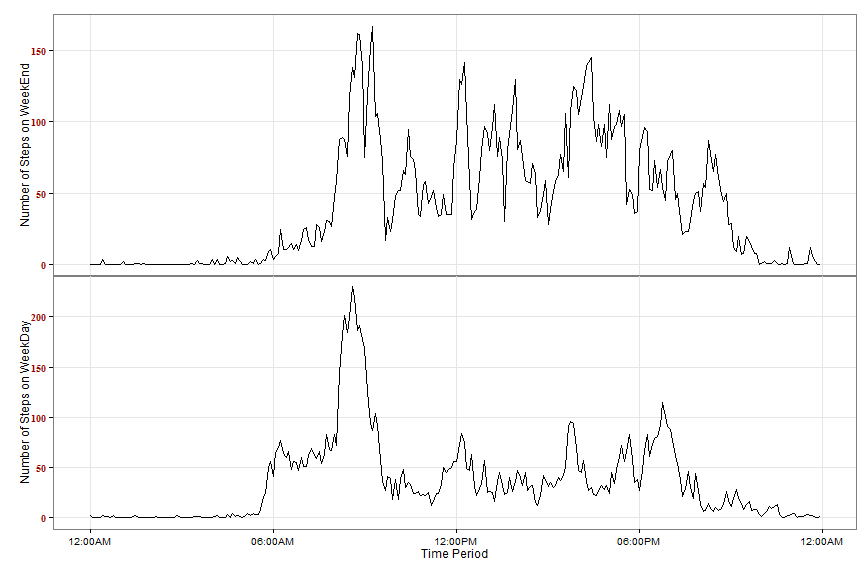

# Analysis of Personal Movement Data
### (Reproducible Research: Peer Assessment 1)

## Introduction

It is now possible to collect a large amount of data about personal movement using activity monitoring devices such as a Fitbit, Nike Fuelband, or Jawbone Up. These type of devices are part of the "quantified self" movement - a group of enthusiasts who take measurements about themselves regularly to improve their health, to find patterns in their behaviour, or because they are tech geeks. But these data remain under-analysed utilized because of following reasons:-

* the raw data is hard to obtain

* there is a lack of statistical methods and software tools for processing and interpreting the data.

* there is lack of skilled manpower to scientifically examine the vast amount of data.
    
In this study we makes use of the data from a personal activity monitoring device. This device collects data at 5 minute intervals through out the day. The data consists of two months of data from an anonymous individual collected during the months of October and November, 2012 and include the number of steps taken in 5 minute intervals each day.
    
## Motivation

In this study we analyse the following questions:-

* What is mean total number of steps taken per day?

* What is the average daily activity pattern?

* Are there differences in activity patterns between weekdays and weekends?

## Data

The data for this assignment can be downloaded from the course web
site:

* Dataset: [Activity monitoring data](https://d396qusza40orc.cloudfront.net/repdata%2Fdata%2Factivity.zip) [52K]

    The brief description of the variables included in this dataset is:
    
        steps    : Number of steps taking in a 5-minute interval (missing values are coded as NA)
        date     : The date on which the measurement was taken in YYYY-MM-DD format
        interval : Identifier for the 5-minute interval in which measurement was taken


## Loading and preprocessing the data

Activity monitoring dataset is stored in a comma-separated-value (CSV) file having 17,568 observations at 5 minute interval for the months of October and November'12. Missing values are coded as "NA". First step in analysis is to load the downloaded data into R data frames. First line of the dataset is a header line which is read along with the dataset. 
    

```r
    library(plyr)
    library(gridExtra)
    library(ggplot2)
    library(scales)    
    
    activityDF <- read.table("activity.csv", header = TRUE, sep = ",", na.strings = "NA")   

    ## varibale dtinterval is added to display customized x axis scale on activity level (last plot)
    
    activityDF$dtinterval <- formatC(activityDF$interval, width = 4, format = "d", flag = "0") 
    activityDF$dtinterval <- paste('01012014',activityDF$dtinterval,sep="")

    activityDF$dtinterval=as.POSIXct(activityDF$dtinterval,"%d%m%Y%H%M",tz="")

    activityDF$interval  <-as.factor(activityDF$interval)
    activityDF$date      <-as.Date(activityDF$date)    

    activityDF$weekday<-weekdays(activityDF$date)
    
    c<-(activityDF$weekday == "Monday" | activityDF$weekday == "Tuesday" | activityDF$weekday ==  "Wednesday" | activityDF$weekday ==  "Thursday" | activityDF$weekday ==  "Friday" )
    activityDF[c,"weekday"]<-"weekday"

    c<-(activityDF$weekday == "Saturday" | activityDF$weekday == "Sunday")
    activityDF[c,"weekday"]<-"weekend"
    
    activityDF$weekday <-as.factor(activityDF$weekday)    
    
    str(activityDF)        
```

```
## 'data.frame':	17568 obs. of  5 variables:
##  $ steps     : int  NA NA NA NA NA NA NA NA NA NA ...
##  $ date      : Date, format: "2012-10-01" "2012-10-01" ...
##  $ interval  : Factor w/ 288 levels "0","5","10","15",..: 1 2 3 4 5 6 7 8 9 10 ...
##  $ dtinterval: POSIXct, format: "2014-01-01 00:00:00" "2014-01-01 00:05:00" ...
##  $ weekday   : Factor w/ 2 levels "weekday","weekend": 1 1 1 1 1 1 1 1 1 1 ...
```

```r
    summary(activityDF)
```

```
##      steps            date               interval    
##  Min.   :  0.0   Min.   :2012-10-01   0      :   61  
##  1st Qu.:  0.0   1st Qu.:2012-10-16   5      :   61  
##  Median :  0.0   Median :2012-10-31   10     :   61  
##  Mean   : 37.4   Mean   :2012-10-31   15     :   61  
##  3rd Qu.: 12.0   3rd Qu.:2012-11-15   20     :   61  
##  Max.   :806.0   Max.   :2012-11-30   25     :   61  
##  NA's   :2304                         (Other):17202  
##    dtinterval                     weekday     
##  Min.   :2014-01-01 00:00:00   weekday:12960  
##  1st Qu.:2014-01-01 05:58:45   weekend: 4608  
##  Median :2014-01-01 11:57:30                  
##  Mean   :2014-01-01 11:57:30                  
##  3rd Qu.:2014-01-01 17:56:15                  
##  Max.   :2014-01-01 23:55:00                  
## 
```

Descriptive statistics reveals variable "steps" has 2304 missing values (encoded as NA's), therefore this fact has to be considered before performing any analysis.


## Imputing missing values

To see impact on results by imputing missing values, similar analysis is performed with & without imputed missing values. 

To device an appropriate strategy for replacing the missing values, few checks are done to ascertain patterns and anomalies in data prior to any preprocessing.


```r
    plot(activityDF$dtinterval,activityDF$steps,xlab="Time Interval",ylab="Number of Steps")
```

 

Scatter plot reveals number of steps taken in a 5 minute interval increases as the day progress and subsequently decreases in the evening, therefore it is reasonably fair to replace missing values with mean of number of steps taken in a 5 minute interval. 

A separate dataset is created with imputed missing values for the purpose.


```r
    ## following piece of code creates a copy of original dataset and imputes values
    
    activityDFCopy<-activityDF 
    missingSteps <- is.na(activityDFCopy$steps)
    
    meanByInterval<-aggregate(steps~interval,activityDFCopy,FUN=mean)
    meanByInterval$steps<-round(meanByInterval$steps)
    
    activityDFCopy[missingSteps,"steps"]  <-  meanByInterval[activityDFCopy[missingSteps,"interval"], "steps"]
    
    summary(activityDFCopy)
```

```
##      steps            date               interval    
##  Min.   :  0.0   Min.   :2012-10-01   0      :   61  
##  1st Qu.:  0.0   1st Qu.:2012-10-16   5      :   61  
##  Median :  0.0   Median :2012-10-31   10     :   61  
##  Mean   : 37.4   Mean   :2012-10-31   15     :   61  
##  3rd Qu.: 27.0   3rd Qu.:2012-11-15   20     :   61  
##  Max.   :806.0   Max.   :2012-11-30   25     :   61  
##                                       (Other):17202  
##    dtinterval                     weekday     
##  Min.   :2014-01-01 00:00:00   weekday:12960  
##  1st Qu.:2014-01-01 05:58:45   weekend: 4608  
##  Median :2014-01-01 11:57:30                  
##  Mean   :2014-01-01 11:57:30                  
##  3rd Qu.:2014-01-01 17:56:15                  
##  Max.   :2014-01-01 23:55:00                  
## 
```

Summary statistics reveals missing values are appropriately substituted.

## Results/Analysis
### Mean number of steps taken per day (with and without missing values)

Histogram of Total number of steps taken per day for the months of October and November'12. 


```r
    ## following piece of code creates a dataset without missing values
    c<-is.na(activityDF$steps)
    activityDFSubset<-activityDF[!c,]

    par(mfrow=c(1,2))
    summaryByDate1 <-aggregate(steps~date,activityDFSubset,FUN=sum) 
    hist(summaryByDate1$steps,breaks=15,xlab="Number of Steps",col="#F15854",border="#5DA5DA",main="Number of Steps/Day",ylim=c(0,25),axes=TRUE)
    box()
    grid()
    
    summaryByDate2 <-aggregate(steps~date,activityDFCopy,FUN=sum) 
    hist(summaryByDate2$steps,breaks=15,xlab="Number of Steps",col="#F15854",border="#5DA5DA", main="Number of Steps/Day", ylim=c(0,25),axes=TRUE)
    box()
    grid()
```

 

First plot excludes missing values whereas second plot is rendered with imputed  values. Visually it appears imputing missing values has the effect of increasing the frequency of bar in which mean is included. 


```r
    ## following piece of code creates Summary Statistics with and without Missing Values
    SummaryWithMissingValues<-summary(summaryByDate1$steps)
    SummaryWithImputedValues<-summary(summaryByDate2$steps)
    
    stepsSummary<- rbind(SummaryWithMissingValues,SummaryWithImputedValues)
    grid.table(stepsSummary)
```

 
#### Table 1 : Summary statistics with & without missing values for variable "steps".

From table 1, it can be inferred that there is no effect on mean, median, maximum and minimum values of the imputed variable. Value of first quartile and 3rd quartile is shifted towards mean.

### Average daily activity pattern (with and without missing values)

Following plot depicts the average number of steps taken in a five minute interval during observation months.


```r
    ## following piece of code creates Activity plot without missing Values
    
    meanByInterval<-aggregate(steps~interval,activityDFSubset,FUN=mean)    
    meanByInterval$steps<-round(meanByInterval$steps)
     
    par(mfrow=c(1,2))
    plot(meanByInterval$steps,typ="l",xlab="Interval",ylab="Average Number of Steps",col="red",main="Average Daily activity pattern",sub="(with missing values)")

    points(meanByInterval[which.max(meanByInterval$steps),], pch=19, col = "red")
    abline(h = meanByInterval[which.max(meanByInterval$steps),"steps"], v = meanByInterval[which.max(meanByInterval$steps),"interval"], col = "gray60")
    grid()

    ## following piece of code creates Activity plot with imputed missing Values    
    
    meanByInterval<-aggregate(steps~interval,activityDFCopy,FUN=mean)    
    meanByInterval$steps<-round(meanByInterval$steps)
     
    plot(meanByInterval$steps,typ="l",xlab="Interval",ylab="", col="red",main="Average Daily activity pattern",sub="(without missing values)")

    points(meanByInterval[which.max(meanByInterval$steps),], pch=19, col = "red")
    abline(h = meanByInterval[which.max(meanByInterval$steps),"steps"], v = meanByInterval[which.max(meanByInterval$steps),"interval"], col = "gray60")
    grid()
```

 

```r
    ## following piece of code find interval of day with maximum Activity
    meanByInterval[which.max(meanByInterval$steps),]   
```

```
##     interval steps
## 104      835   206
```

From the data above,one concludes that maximum number of steps are recorded at 8:35 morning, which is intuitively attributed to period of day when one is most active.  

There is no effect on nature of graphs when replacing/substituting missing values.

### Level of Activity patterns on Weekdays and Weekends

```r
    subplot <- function(x, y) viewport(layout.pos.row = x,layout.pos.col = y)
    vplayout <- function(...) {
        Layout <- grid.layout(nrow = 2, ncol = 1) #, heights = unit(c(5,1.25,1.25), "inches"))  
        grid.newpage()
        pushViewport(viewport(layout = Layout))
    }

    mmplot<- function(a, b) 
    {
         vplayout()     
         print(a, vp = subplot(1, 1))
         print(b, vp = subplot(2, 1))
    }
    
    meanByInterval<-aggregate(steps~dtinterval,activityDFCopy[activityDFCopy$weekday=="weekend",],FUN=mean)
    meanByInterval$steps<-round(meanByInterval$steps)
    plot1<- ggplot(data=meanByInterval, aes(x = dtinterval,y=steps),group=1) + 
            geom_line() +
            theme_bw() + 
            xlab(" ") +
            ylab("Number of Steps on WeekEnd") +
            theme(axis.text.x = element_blank())+   
            theme(axis.text.y  = element_text(family="serif" ,face="bold", colour = "#990000", size  = 10)) +             
            theme(panel.grid.minor = element_blank(),panel.background = element_blank())+            
            theme(plot.margin = unit(c(1,.5, -.9, 1), "lines"))       ## top, right, bottom, left

    meanByInterval<-aggregate(steps~dtinterval,activityDFCopy[activityDFCopy$weekday=="weekday",],FUN=mean)
    meanByInterval$steps<-round(meanByInterval$steps)
    plot2<- ggplot(data=meanByInterval, aes(x = dtinterval,y=steps),group=1) +
            geom_line() +
            theme_bw() + 
            xlab("Time Period") +
            ylab("Number of Steps on WeekDay") +            
            
            scale_x_datetime(labels = date_format("%I:%M%p"))+
            
            theme(axis.text.y  = element_text(family="serif" ,face="bold", colour = "#990000", size  = 10)) +                
            theme(panel.grid.minor = element_blank(),panel.background = element_blank())+            
            theme(plot.margin = unit(c(-.9,.5, 1, 1), "lines"))        ## top, right, bottom, left
                
    mmplot(plot1,plot2)
```

 

Activity level patterns on weekends and weekdays reveals following trends:-

* On Weekday activity level starts early near about 6AM, peaks during 8 -10AM period, thereafter it decreases and hovers around 50% of the peak value(200 steps). After 7PM there is substantial decrease in the activity level.

* On Weekends activity level starts a bit late near about 7AM, peaks during 8 -10AM period, thereafter it fluctuates up and down but remain moderately high throughout the day till near about 8 PM. After 9.00PM there is substantial decreases in activity level and still there are couple of spikes till very late. 
